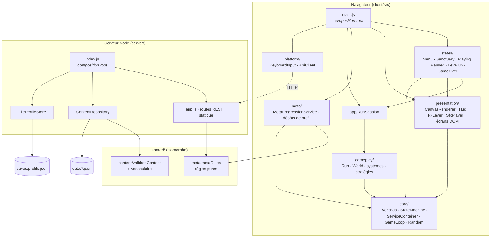
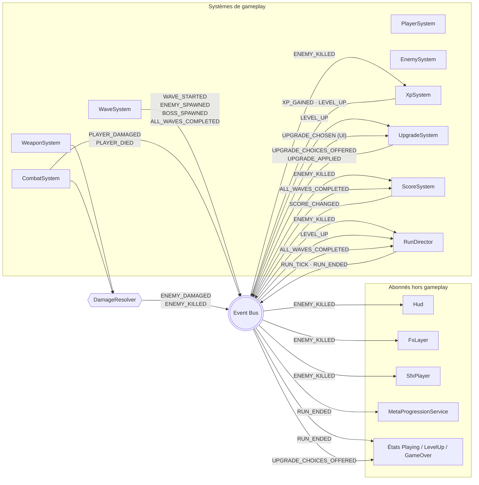
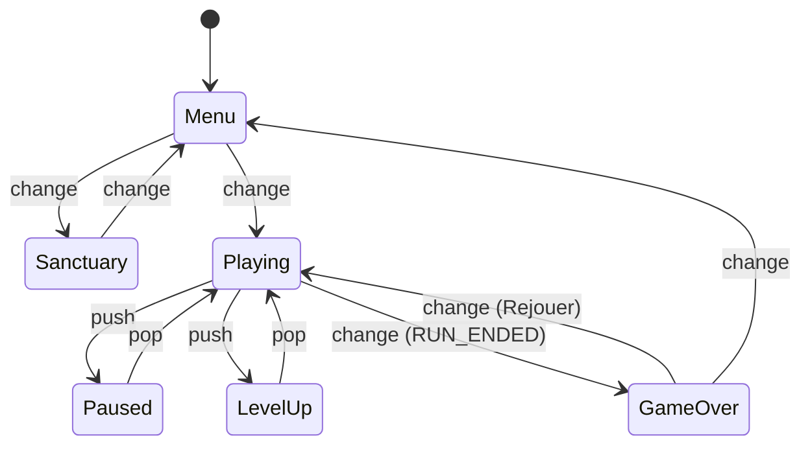
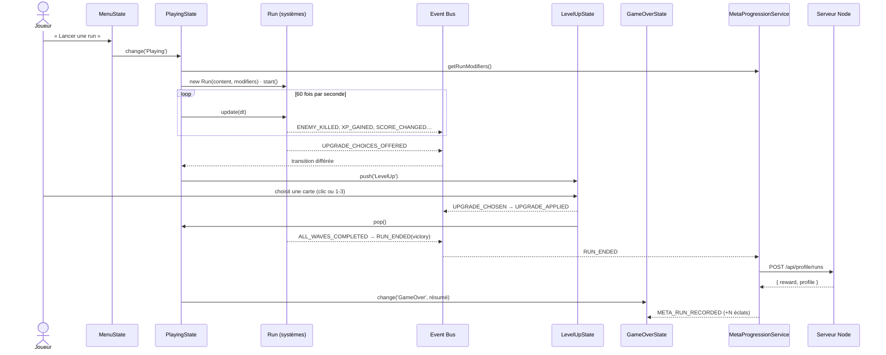

# Projet Aegis — Document d'architecture

> Prototype de rogue-lite à vagues d'ennemis (« survivors-like ») réalisé en **Node.js** : un serveur HTTP
> sans dépendance sert le jeu, ses données et la sauvegarde de la méta-progression ; le jeu lui-même tourne
> dans le navigateur (Canvas 2D, modules ES natifs).
>
> Lancer : `npm start` puis <http://127.0.0.1:3000> — ou double-cliquer sur `Aegis.exe` (build Windows).

## Sommaire

1. [Choix du « moteur » et justification](#1-choix-du-moteur-et-justification)
2. [Vue d'ensemble : couches et règle de dépendance](#2-vue-densemble--couches-et-règle-de-dépendance)
3. [Les systèmes et leurs communications](#3-les-systèmes-et-leurs-communications)
4. [Choix techniques, raisons et limites assumées](#4-choix-techniques-raisons-et-limites-assumées)
5. [Déroulé d'une run minimale](#5-déroulé-dune-run-minimale)
6. [Organisation du dépôt](#6-organisation-du-dépôt)
7. [Qualité : tests, simulation, historique Git](#7-qualité--tests-simulation-historique-git)
8. [Limites connues et ce qui serait fait avec plus de temps](#8-limites-connues-et-ce-qui-serait-fait-avec-plus-de-temps)

---

## 1. Choix du « moteur » et justification

Le sujet laisse le moteur libre (Unity, Unreal, Godot…). La particularité de ce rendu est d'être **un site
web servi par Node.js**. Le « moteur » est donc une petite base maison :

| Besoin | Réponse retenue |
|---|---|
| Rendu | API Canvas 2D du navigateur |
| Boucle de jeu | `GameLoop` à pas fixe (60 Hz) + `requestAnimationFrame` |
| Serveur, données, sauvegarde | Node.js ≥ 20, module `http` natif, **zéro dépendance d'exécution** |
| Modules | ES modules natifs, sans bundler (le navigateur charge directement `client/src/*.js`) |
| Livraison Windows | `Aegis.exe` : serveur regroupé par esbuild + runtime Node 22 embarqué par `pkg` |

**Pourquoi ne pas utiliser Phaser, PixiJS ou un framework serveur (Express) ?**
L'évaluation porte à 50 % sur l'architecture. Un framework de jeu apporte *sa* machine à états (scènes), *son*
émetteur d'événements et *son* gestionnaire de ressources : on aurait surtout démontré qu'on sait utiliser
Phaser. Écrire ces briques (≈ 400 lignes pour le cœur) rend chaque décision visible et justifiable. Côté
serveur, cinq routes REST ne justifient pas une dépendance : le routeur maison tient en moins de 50 lignes.

**Ce que Node.js apporte réellement à l'architecture**

- **Code isomorphe** : les règles de méta-progression et la validation des données (`shared/`) sont
  exécutées à l'identique par le serveur et par le navigateur.
- **Le gameplay tourne sans navigateur** : la couche `gameplay/` n'utilise ni DOM ni réseau, donc Node peut
  simuler des runs complètes (`npm run simulate`) et les tests peuvent jouer une vraie partie.
- **Un serveur autoritaire pour la persistance** : le client envoie un résumé de run, le serveur calcule
  lui-même la récompense et valide les achats.

**Limites assumées de ce choix** : pas d'éditeur visuel (niveaux, animations), pas de moteur physique (les
collisions sont des cercles), rendu 2D volontairement sobre (formes géométriques, sons synthétisés), et des
performances JavaScript qui imposent de garder le nombre d'entités raisonnable (≈ 200 ennemis).

---

## 2. Vue d'ensemble : couches et règle de dépendance



**Règle de dépendance** : les flèches vont toujours vers des couches plus stables.

- `core/` ne dépend de rien (réutilisable dans n'importe quel jeu).
- `gameplay/` ne dépend que de `core/` : **aucun import de DOM, réseau, UI ou méta-progression**.
- `presentation/` *lit* le monde et *écoute* les événements, mais ne modifie jamais l'état de jeu.
- `meta/` ne connaît pas le gameplay : elle reçoit un résumé de run (événement) et renvoie des données.
- Seules les **composition roots** (`client/src/main.js`, `gameplay/Run.js`, `server/index.js`) connaissent
  les classes concrètes et les assemblent.

La séparation demandée par le sujet est donc explicite : **logique de gameplay** (`gameplay/`),
**présentation** (`presentation/`, `states/`, `client/index.html`, `styles.css`) et **données** (`data/`).

---

## 3. Les systèmes et leurs communications

Une run est une liste **ordonnée** de systèmes (`SYSTEM_DEFINITIONS` dans `gameplay/Run.js`) qui ne se
référencent jamais entre eux : ils partagent le `World` (données) et communiquent par l'**Event Bus**.



L'exemple du sujet est littéralement implémenté : **un ennemi tué** émet `ENEMY_KILLED` (par le
`DamageResolver`), capté indépendamment par l'`XpSystem` (orbe d'XP), le `ScoreSystem` (points),
le `RunDirector` (statistiques de fin), le `Hud` (compteur), le `FxLayer` (particules) et le `SfxPlayer` (son).

| Système | Rôle | Écoute | Émet |
|---|---|---|---|
| `PlayerSystem` *(requis)* | déplacement via une **source d'entrée abstraite**, régénération | — | `PLAYER_HEALED` |
| `WaveSystem` | vagues d'un **fournisseur** (campagne ou infini), apparitions, boss, chrono de boss | `RUN_STARTED`, `ENEMY_KILLED` | `WAVE_*`, `ENEMY_SPAWNED`, `BOSS_SPAWNED`, `BOSS_TIMER_*` |
| `EnemySystem` | comportements (stratégies), recul, séparation | — | `ENEMY_TELEGRAPH` (via stratégie) |
| `WeaponSystem` | fait agir chaque arme selon son `kind` | — | `WEAPON_FIRED` |
| `CombatSystem` *(requis)* | collisions projectiles/ennemis/joueur | — | `PLAYER_DAMAGED`, `PLAYER_DIED` |
| `XpSystem` | orbes, aimant, courbe d'XP | `ENEMY_KILLED` | `XP_GAINED`, `LEVEL_UP` |
| `UpgradeSystem` | tirage pondéré, application des effets | `LEVEL_UP`, `UPGRADE_CHOSEN` | `UPGRADE_CHOICES_OFFERED`, `UPGRADE_APPLIED` |
| `ScoreSystem` | score | `ENEMY_KILLED`, `RUN_TICK`, `ALL_WAVES_COMPLETED` | `SCORE_CHANGED` |
| `RunDirector` *(requis)* | horloge, conditions de fin, résumé | mode, kills, boss, score, niveau, vague, mort, chrono expiré, victoire | `RUN_TICK`, `RUN_ENDED` |

Le catalogue complet des événements et de leurs payloads est dans `client/src/core/events.js` : c'est le
**contrat** entre systèmes.

**Désactiver ou remplacer un système** : ajoutez `?disable=score,xp,upgrades,waves,enemies,weapons,sfx,fx`
à l'URL (ou passez `disabled` à `new Run(...)`). Le jeu continue de fonctionner : sans `score`, le HUD affiche
« — » et le résumé indique 0 ; sans `xp`, plus de montée de niveau ; sans `sfx`, silence. Les tests
`tests/gameplay/decoupling.test.js` jouent 40 secondes de run **sans chacun des systèmes optionnels**, puis
**sans aucun**, et vérifient qu'aucune exception n'est levée. Seuls `player`, `combat` et `director` sont
marqués `required` (sans eux, une run n'a plus de sens : pas de joueur, pas de fin).

---

## 4. Choix techniques, raisons et limites assumées

### 4.1 Machine à états des états globaux

`core/StateMachine.js` est une **machine à pile** (*pushdown automaton*) :

- `change(état)` remplace toute la pile (Menu → En jeu → Game Over → Menu) ;
- `push(état)` empile un **overlay** sans quitter l'état courant (En jeu → Pause, En jeu → Choix d'amélioration) ;
- `pop()` revient à l'état précédent, qui reçoit `resume()`.



**Pourquoi** :

- *Pas de code dupliqué entre états* : la pause et le choix d'amélioration n'ont pas à re-dessiner le jeu ;
  la machine rend **toute la pile** (le monde figé reste visible dessous) mais ne met à jour **que le sommet**.
  La run n'est ni détruite ni réinitialisée par une pause.
- *Transitions claires* : elles sont déclarées dans **une seule table** (`states/transitions.js`) ; une
  transition non prévue lève une erreur explicite (`Transition interdite : Menu → GameOver`) au lieu de
  produire un état incohérent.
- *Transitions différées* : un événement de gameplay (fin de run, offre d'amélioration) survient **pendant**
  `run.update()`. `PlayingState` met la transition en attente et l'applique après la mise à jour : on ne
  détruit jamais une run au milieu de sa propre boucle.

**Limites** : pas d'états hiérarchiques ni parallèles ; la table n'autorise pas de gardes conditionnelles
(elles sont codées dans les états) ; la machine ne gère pas les transitions animées (fondu) elle-même.

### 4.2 Event Bus (Observer / Pub-Sub)

`core/EventBus.js` : `on / once / off / emit`, `on()` renvoie sa fonction de désabonnement, et un
`SubscriptionGroup` libère tous les abonnements d'un système en fin de run (vérifié par test : **aucun
abonné ne survit à `run.dispose()`**).

**Pourquoi ces choix** :

- *Synchrone* : l'ordre des effets est déterministe (indispensable pour rejouer une run à partir d'une graine)
  et se débogue pas à pas.
- *Isolation des erreurs* : chaque handler est exécuté dans un `try/catch` ; un système défaillant est
  signalé (`onError`) mais **ne casse pas les autres abonnés**.
- *Noms centralisés* (`events.js`) : pas de chaîne magique dispersée ; le catalogue sert de documentation.

**Limites assumées** : le flux de contrôle est moins lisible qu'un appel direct (qui réagit à quoi ? →
catalogue + overlay `?debug=1` qui affiche les événements/s) ; les payloads ne sont typés que par JSDoc ;
l'ordre entre abonnés d'un même événement est l'ordre d'abonnement (implicite) ; une cascade d'événements
s'exécute en profondeur, ce qui a imposé les transitions différées décrites ci-dessus.

### 4.3 Gestion des managers / services : injection de dépendances

Le sujet interdit les singletons statiques accessibles de partout. Choix retenu : **injection par
constructeur + composition roots**.

- Chaque classe déclare ses dépendances dans son constructeur (`new XpSystem({ bus, world, xpCurve })`).
- `core/ServiceContainer.js` (registre de fabriques paresseuses, détection de cycles, `override`) n'est
  utilisé **que** dans `client/src/main.js`. Il n'est jamais passé aux systèmes : ce serait un
  *Service Locator* qui masquerait les vraies dépendances.
- Le gameplay a sa propre composition root, `gameplay/Run.js` : une **table de fabriques de systèmes**,
  ce qui permet d'en retirer un par identifiant.
- Côté serveur, `server/index.js` construit `ContentRepository` et `FileProfileStore`, puis les injecte
  dans `createApp()` ; les tests injectent un `MemoryProfileStore` à la place.

| Critère | Singleton statique | Service Locator | **DI + composition root (retenu)** |
|---|---|---|---|
| Couplage | fort, caché | moyen, caché | explicite dans la signature |
| Testabilité | difficile (état global) | moyenne | **triviale** (doublures passées au constructeur) |
| Remplacement | modifier le code | reconfigurer le registre | **changer une ligne de la composition root** |
| Coût | nul | faible | câblage plus verbeux |

Exemples concrets de remplacement : `KeyboardInput` ↔ `AutopilotInput` (même interface
`getMoveVector()`), `HttpProfileRepository` ↔ `LocalProfileRepository` (bascule automatique si l'API est
injoignable, ou `?storage=local`), `FileProfileStore` ↔ `MemoryProfileStore`.

**Limites** : câblage manuel un peu verbeux dans `main.js` ; clés du conteneur en chaînes, non typées ;
une seule durée de vie (instance unique paresseuse) — la portée « par run » est gérée à la main par `Run`.

### 4.4 Conception orientée données

Tout le contenu est dans `data/`, **aucune valeur d'équilibrage n'est codée en dur** :

| Fichier | Contenu |
|---|---|
| `config.json` | courbe d'XP, nombre de choix, rayons d'apparition, récompenses méta, effets activés |
| `player.json` | statistiques de base, armes de départ |
| `enemies.json` | 6 types (dont 2 boss) : PV, vitesse, dégâts, XP, score, **comportement** + paramètres |
| `waves.json` | 3 vagues de la campagne : durée, règles d'apparition périodiques (intervalle interpolé) ou ponctuelles, boss, multiplicateurs `scale` optionnels |
| `endless.json` | paramètres du **mode infini** : durée des vagues, boss tous les N vagues, chrono du boss, bassins d'apparition, courbes de renforcement des ennemis et des boss, surcharges de config |
| `weapons.json` | 3 armes : **type** (`projectile`, `orbit`, `pulse`), **ciblage**, statistiques |
| `upgrades.json` | 17 améliorations de run : poids, cumul max (`maxStacks`), limite absolue sans plafond (`hardMaxStacks`), prérequis, liste d'**effets** |
| `meta-upgrades.json` | 6 améliorations permanentes : coûts par niveau, effet |

Le lien entre données et code passe par des **stratégies indexées par nom** (registres) :
`enemyBehaviors` (`chase`, `zigzag`, `charge`), `weaponKinds`, `targetingStrategies`, `upgradeEffects`
(`stat`, `heal`, `grantWeapon`, `weaponStat`), `gameModes` (`story`, `endless`). Les améliorations de run et méta passent toutes par le même
mécanisme de `Stats` à modificateurs : `valeur = (base + Σ add) × (1 + Σ mul)`.

**Validation (fail fast)** : au démarrage, le serveur valide la forme **et l'intégrité référentielle**
(`shared/content/validateContent.js`) : une vague qui cite un ennemi inconnu, une amélioration sur une stat
inexistante, un comportement non implémenté ou un identifiant dupliqué empêchent le lancement avec un
message précis (`waves.waves[0].spawns[0].enemy : ennemi inconnu "dragon"`). `npm run validate-data` fait
la même vérification sans lancer le serveur, et un test garantit que le vocabulaire déclaré dans
`shared/content/vocabulary.js` correspond exactement aux implémentations du client.

**Ajouter du contenu** :

- *un ennemi* → une entrée dans `enemies.json` + l'utiliser dans `waves.json`. Aucune ligne de code.
- *une amélioration* → une entrée dans `upgrades.json` combinant des effets existants. Aucune ligne de code.
- *un nouveau comportement / type d'arme / type d'effet* → une fonction dans le registre concerné + son nom
  dans `vocabulary.js`. Aucun système existant n'est modifié.
- Dans la version `.exe`, un dossier `data/` placé à côté de l'exécutable est prioritaire : on peut
  rééquilibrer le jeu sans recompiler.

**Limites** : validation écrite à la main plutôt qu'un JSON Schema standard ; pas d'éditeur ni de
rechargement à chaud ; JSON sans commentaires ; les formules (courbe d'XP, dégâts) restent dans le code,
seuls leurs paramètres sont en données.

### 4.5 Méta-progression persistante, découplée de la run

- **Entrée** : `MetaProgressionService` n'écoute qu'**un** événement, `RUN_ENDED` (résumé : mode, issue,
  cause, score, éliminations, niveau, vague, boss vaincus, durée).
- **Sortie** : `getRunModifiers()` renvoie de **simples données** (`statModifiers`, `startingWeapons`, `weaponModifiers`)
  que `RunSession` passe à `new Run(...)`. Le gameplay ignore l'existence de la méta.
- **Règles pures et partagées** (`shared/meta/metaRules.js`) : calcul de la récompense (éclats), achat
  (coût, niveau max, solde), assainissement d'un profil corrompu ou d'un résumé malformé.
- **Serveur autoritaire** : `POST /api/profile/runs` calcule la récompense côté serveur ; `POST
  /api/profile/purchases` vérifie coût et niveau. Le client n'envoie jamais un solde.
- **Stockage** : `FileProfileStore` écrit de façon **atomique** (fichier temporaire + `rename`) et
  **sérialise** les écritures concurrentes ; un fichier illisible est mis de côté (`.corrupt`) au lieu de
  bloquer le jeu.

**Limites** : un seul profil local, sans authentification ; le résumé de run reste déclaratif (un client
modifié pourrait annoncer un faux score — acceptable pour un prototype local, voir § 8).

### 4.6 Modes de jeu : campagne et mode infini

Le mode infini a été ajouté **sans nouveau système** : il ne fait que *configurer* la run.

- **Stratégie de mode** (`gameplay/modes/gameModes.js`, registre indexé par nom comme les autres) :
  `configure(content)` renvoie le fournisseur de vagues, la configuration de run (le mode infini y
  surcharge la courbe d'XP) et `upgradesUncapped`. `new Run({ mode })` l'applique ; le mode est annoncé dans
  `RUN_STARTED` et recopié dans le résumé `RUN_ENDED`.
- **Fournisseur de vagues** (`gameplay/waves/`) : le `WaveSystem` ne lit plus un tableau mais une interface
  `{ total, get(index) }`. `ScriptedWaveProvider` sert `waves.json` (`total = 3`) ; `EndlessWaveProvider`
  **génère** la vague *n* à la demande (`total = null`), de façon déterministe, à partir de `endless.json` :
  bassins d'ennemis débloqués progressivement, intervalles qui raccourcissent, ennemis renforcés via le champ
  `scale` des règles (PV, dégâts, vitesse, XP, score). Toutes les `bossEvery` (10) vagues : une vague de boss
  (boss tournant entre le Gardien déchu et le Titan abyssal) **plus gros et plus puissant à chaque palier**.
- **Chrono de boss** : une vague peut déclarer `bossTimeLimit`. À l'apparition du boss, le `WaveSystem` lance
  un compte à rebours (`BOSS_TIMER_STARTED`, `BOSS_TIMER_TICK` chaque seconde) ; boss tué → `BOSS_TIMER_STOPPED
  { expired: false }` et la vague suivante commence ; temps écoulé → `{ expired: true }`, que le `RunDirector`
  transforme en défaite (`cause: 'bossTimeout'`). Le HUD affiche chrono et barre de vie du boss en écoutant
  ces événements. Le chrono se fige pendant la pause et le choix d'amélioration (la run n'est pas mise à jour).
- **Améliorations sans limite** : avec `uncapped`, l'`UpgradeSystem` ignore `maxStacks` ; seules les limites
  absolues `hardMaxStacks` (réduction de recharge plafonnée, vitesse, nombre de projectiles/lames) et les
  améliorations uniques (`maxStacks: 1`, déblocage d'arme) s'appliquent.
- **Méta** : récompense bonus par boss vaincu (`config.rewards.endlessBossKillBonus`), statistiques
  `bestEndlessWave` (record affiché au menu, « nouveau record » en fin de run) et `endlessBossKills`. Le
  serveur refuse qu'une run infinie soit une « victoire » et borne `bossKills` au nombre de vagues.

Réglage par simulation (`npm run simulate -- --mode=endless`) : l'IA atteint en général la vague 40–60
(≈ 25–30 min) ; le mur vient à la fois des vagues (PV × 1,03ⁿ) et des boss (PV × 3 par palier).

### 4.7 Déterminisme et testabilité

Le générateur aléatoire (`core/Random.js`, mulberry32) est injecté partout : une même graine rejoue la même
run (`?seed=42`). La `GameLoop` reçoit son horloge et son planificateur par injection : les tests et la
simulation avancent le temps manuellement.

---

## 5. Déroulé d'une run minimale



Contenu de la run livrée (≈ 2 min 30 à 3 min) : **vague 1** « Les premières ombres » (40 s), **vague 2**
« La meute » (50 s, chargeurs et colosses), **vague 3** « Le Gardien déchu » (boss à 800 PV qui charge ;
la vague ne se termine qu'à sa mort). Ramassage d'XP, choix parmi 3 améliorations à chaque niveau, score
final, récompense en éclats, puis boutique permanente dans le menu.

**Écran titre** : les deux modes sont présentés côte à côte (cartes générées à partir des données par
`app/modeSummaries.js`) ; les améliorations permanentes ont leur **propre état**, `Sanctuary` (Menu ⇄
Sanctuary), avec son écran `SanctuaryScreen`.

**Mode infini** (carte « L'Ascension sans fin » de l'écran titre, touche I, ou `?autostart=1&mode=endless`) : même boucle, mais les
vagues de 30 s ne s'arrêtent jamais, un boss géant apparaît toutes les 10 vagues et doit être tué en moins
de 60 s, les améliorations se cumulent sans plafond. La run se termine à la mort ou à l'expiration du chrono ;
« Rejouer » relance le même mode.

---

## 6. Organisation du dépôt

```text
Projet-Aegis/
├── client/                      # tout ce qui s'exécute dans le navigateur
│   ├── index.html · styles.css  # présentation statique
│   └── src/
│       ├── main.js              # composition root du client
│       ├── core/                # moteur générique : EventBus, StateMachine, ServiceContainer, GameLoop, Random, math, events
│       ├── gameplay/            # logique de jeu pure (aucun DOM) : Run, World, Stats, DamageResolver
│       │   ├── systems/         # 9 systèmes (GameSystem de base)
│       │   ├── modes/           # stratégies de mode de jeu (campagne, infini)
│       │   ├── waves/           # fournisseurs de vagues (scénarisé, généré à l'infini)
│       │   ├── entities/        # Player, EnemyFactory
│       │   ├── behaviors/       # stratégies de comportement d'ennemi
│       │   ├── weapons/         # Arsenal, WeaponInstance, types d'armes et ciblage
│       │   └── upgrades/        # effets d'amélioration
│       ├── app/                 # RunSession (pont méta ↔ gameplay)
│       ├── meta/                # MetaProgressionService + dépôts de profil (HTTP, local)
│       ├── states/              # états globaux + table de transitions
│       ├── presentation/        # CanvasRenderer, FxLayer, Hud, SfxPlayer, DebugOverlay, écrans DOM
│       ├── platform/            # adaptateurs navigateur : clavier, HTTP
│       └── debug/               # AutopilotInput, AutoChooser
├── shared/                      # code isomorphe serveur/navigateur
│   ├── content/                 # validation des données + vocabulaire reconnu
│   └── meta/                    # règles pures de méta-progression
├── server/                      # serveur Node.js (zéro dépendance)
│   ├── index.js                 # composition root + démarrage
│   ├── app.js                   # application HTTP injectable
│   ├── http/                    # routeur, réponses, fichiers statiques
│   ├── routes/                  # /api/content, /api/profile…
│   ├── content/                 # ContentRepository (chargement + validation de data/)
│   └── persistence/             # FileProfileStore, MemoryProfileStore
├── data/                        # contenu du jeu en JSON
├── tests/                       # node:test — core, gameplay, shared, server
├── tools/                       # simulate-run, validate-data, build-win
└── docs/ARCHITECTURE.md         # ce document
```

---

## 7. Qualité : tests, simulation, historique Git

- `npm test` : **82 tests** `node:test` (aucune dépendance) — bus, machine à états, conteneur, boucle,
  chaque système isolé avec des doublures, découplage (run sans chaque système), absence de fuite
  d'abonnements, run complète simulée et déterministe, règles méta, validation des données, API HTTP,
  sécurité du serveur statique (traversée de répertoires), écriture atomique des sauvegardes.
- `npm run simulate -- --runs=10` : joue des runs entières avec le **vrai code de gameplay** dans Node,
  pilotées par l'`AutopilotInput`. L'équilibrage des vagues a été réglé ainsi (victoire en ≈ 145–360 s selon
  la graine pour l'IA). `--mode=endless` fait de même pour le mode infini (arrêt à la mort ou au chrono).
- Démo navigateur : `?autopilot=1&autostart=1&debug=1&speed=3` — une IA joue, l'overlay montre la pile
  d'états, les systèmes actifs et le débit d'événements.
- Historique Git : commits atomiques par couche/fonctionnalité, messages conventionnels en français
  (`feat(core)`, `feat(gameplay)`, `balance:`, `test:`, `build:`, `docs:`).

---

## 8. Limites connues et ce qui serait fait avec plus de temps

**Limites connues**

- *Performances* : collisions et séparation en O(n²) (suffisant pour ≈ 200 ennemis, pas pour 2 000) ;
  entités en objets JS avec allocations (pas de *pooling*).
- *Sécurité de la méta* : le serveur fait confiance au résumé de run envoyé par le client.
- *Contenu* : graphismes géométriques, sons synthétisés, pas de manette, interface en français uniquement.
- *Exécutable Windows* : il lance un serveur local et ouvre le navigateur par défaut (fenêtre console
  visible) plutôt qu'une fenêtre native ; ≈ 58 Mo car il embarque Node.
- *Typage* : JavaScript + JSDoc ; les payloads d'événements ne sont pas vérifiés à la compilation.

**Avec plus de temps**

1. **TypeScript** et des événements typés (`EventMap`) pour que le contrat du bus soit vérifié à la compilation.
2. **Grille spatiale** (spatial hash) et *object pooling* ; à terme une architecture **ECS** si le nombre
   d'entités l'exige.
3. **JSON Schema** + petit éditeur web de contenu servi par le serveur Node, avec **rechargement à chaud**
   des données (le serveur surveille `data/` et notifie le client via Server-Sent Events).
4. **Validation serveur des runs** : grâce au déterminisme, envoyer graine + entrées et rejouer la run côté
   serveur pour recalculer le score (anti-triche), puis classements en ligne.
5. Plusieurs profils, comptes et synchronisation ; sauvegarde en base (SQLite) via une nouvelle
   implémentation de l'interface de stockage, sans toucher au reste.
6. Packaging en application de bureau (Electron/Tauri) pour une vraie fenêtre native ; support manette ;
   sprites, animations et audio produits ; accessibilité (remappage, daltonisme) et i18n.
7. Machine à états hiérarchique pour gérer des sous-états (tutoriel, cinématiques) et des transitions animées.
